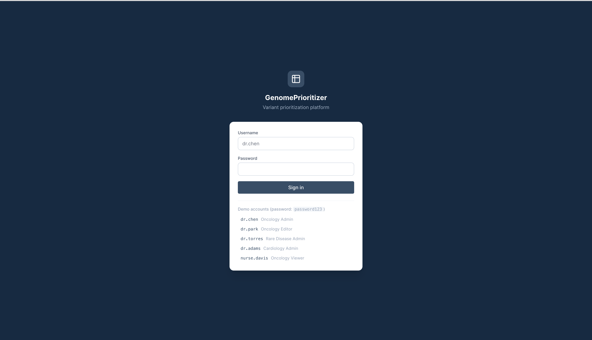
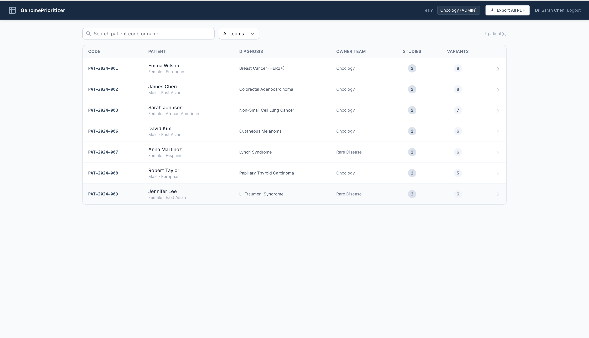
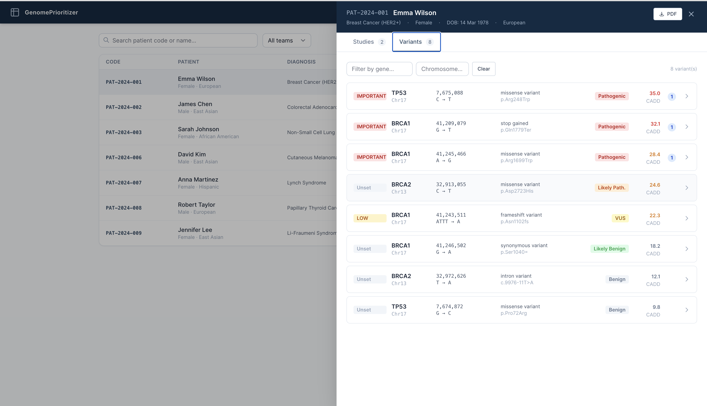
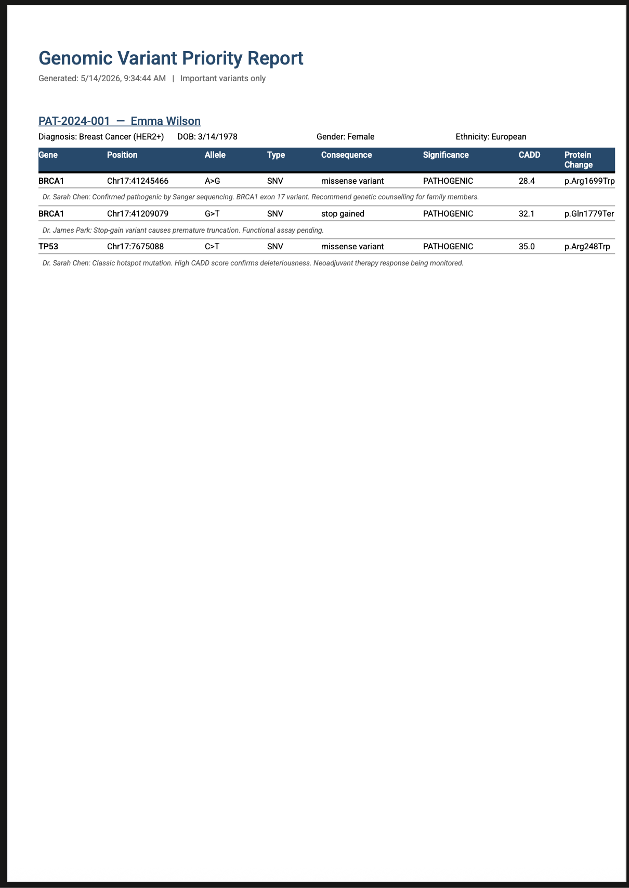

# GenomePrioritizer

> Clinicians need to triage hundreds of genomic variants per case. This platform lets clinical teams collaboratively prioritise variants with role-based access, shared annotations, audit trails, and one-click PDF reports.

Built during 3+ years of production clinical genomics work — not a toy project.

## Screenshots

### Login


### Patient list


### Variant filtering & prioritisation


### PDF report


## Features

- **Multi-org RBAC** — Admin / Editor / Viewer roles per team; users only see their team's patients
- **Variant triage** — mark variants Important / Low Priority / Avoid; filter by gene or chromosome
- **Shared annotations** — team notes per variant, visible to all team members in real time
- **Audit trail** — every priority change logged with user, timestamp, and previous value
- **PDF reports** — download important variants + notes per patient or across all patients
- **Secure auth** — JWT, bcrypt password hashing, rate limiting, helmet headers

## Architecture

```
┌─────────────────┐     ┌──────────────────────┐     ┌────────────┐
│   Vue 3 + Vite  │────▶│  Express + TypeScript │────▶│ PostgreSQL │
│   Tailwind CSS  │     │  Prisma ORM           │     │ (via       │
│   nginx (prod)  │     │  JWT auth             │     │  Docker)   │
└─────────────────┘     │  pdfmake reports      │     └────────────┘
                        └──────────────────────┘
         All containers orchestrated via docker-compose
```

## Stack

| Layer | Choice |
|---|---|
| Frontend | Vue 3 + TypeScript + Tailwind CSS |
| Backend | Node.js + Express + TypeScript |
| ORM | Prisma |
| Database | PostgreSQL |
| Auth | JWT + bcrypt |
| PDF generation | pdfmake |
| Container | Docker + docker-compose |

## Quick start

```bash
git clone https://github.com/samnit007/genomic-prioritizer.git
cd genomic-prioritizer
docker-compose up --build
```

- Frontend: http://localhost:8080
- Backend API: http://localhost:3000

First boot takes ~3–5 minutes (builds images + seeds database with demo data).

## Demo accounts

Password for all accounts: `password123`

| Username | Team | Role |
|---|---|---|
| dr.chen | Oncology | Admin |
| dr.park | Oncology | Editor |
| nurse.davis | Oncology | Viewer |
| dr.torres | Rare Disease | Admin |
| dr.wong | Rare Disease | Editor |
| dr.adams | Cardiology | Admin |
| dr.liu | Cardiology | Editor |
| nurse.brown | Rare Disease | Viewer |

Log in as two different users from different teams to see the org isolation in action.

## What I'd add next

This codebase was built for correctness and team workflows. The natural AI extensions:

- **Variant auto-classification** — feed the variant's gene, consequence, and population frequency into Claude to get a draft priority with reasoning, which a clinician then approves or overrides (human-in-the-loop, same pattern as my [PR Reviewer Agent](https://github.com/samnit007/pr-reviewer-agent))
- **RAG over clinical literature** — embed PubMed abstracts for each gene family; surface relevant papers alongside each variant (same stack as my [DocuMind](https://github.com/samnit007/documind) project)
- **Audit trail summarisation** — LLM-generated case summary from the audit log, exportable to the PDF report
- **Natural language variant search** — "show me all pathogenic BRCA1 variants flagged this month" instead of manual filters
